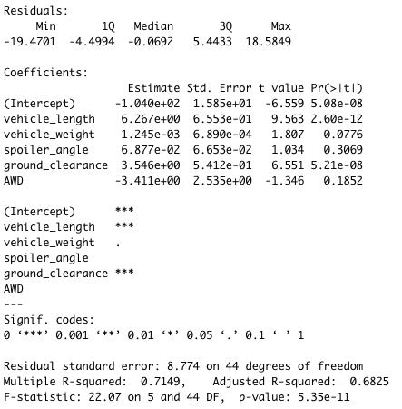
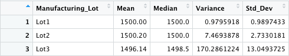
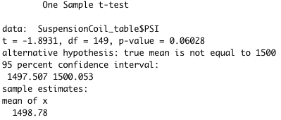
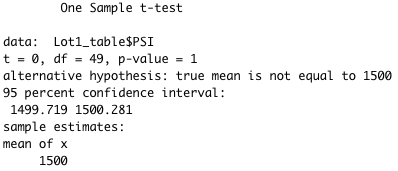
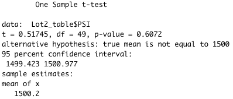
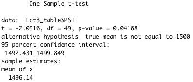

# MechaCar Statistical Analysis

## Overview of Project
This project reviews the production data of AutosRUs’ new prototype (the MechaCar) in order to provide insights that may help the manufacturing team. The analysis will:
1.	Identify which variables will be a factor for the mpg of MechaCar prototypes by performing multiple linear regression analysis
2.	Produce summary statistics on the pounds per square inch (PSI) of the suspension coils from the different manufacturing lots
3.	Conduct t-tests to determine if manufacturing lots are statistically different from the mean population
4.	Design a statistical study to compare MechaCar’s performance against competitors

## 1. Linear Regression to Predict MPG
#### **_Summary of Linear Model_**
  
In our summary output, the Pr(>ltl) value represents the probability that each variable contributes a random amount of variance to the linear model. According to our results, vehicle length (2.60e-12) and ground clearance (5.21e-08) are statistically unlikely to provide random amounts of variance to the linear model, meaning that they have a significant impact on mpg.

The p-value of our linear regression analysis is 5.35e-11, which is much smaller than our assumed significance level of 0.05%. Therefore, the slope of our linear model is not considered to be zero.

Lastly, this model adequately predicts the mpg of the MechaCar as the r-squared value is 0.7149, meaning roughly 71% of the variability of the mpg can be explained using this model. 

## 2. Summary Statistics on Suspension Coils
The design specifications for the MechaCar suspension coils dictate that the variance of the suspension coils must not exceed 100 PSI. 

#### **_Total Summary_**
  
In our summary for all lots, the variance is within design specifications

#### **_Lot Summary_**
  
Lot 1 – yes, meets design specifications (variance = 0.98)  
Lot 2 – yes, meets design specifications (variance = 7.47)  
Lot 3 – no, does not meet design specifications (variance = 170.29)

## 3. T-Tests on Suspension Coils 
 The following are the results from the one-sample t-tests for all manufacturing lots and each lot individually:  
 #### **_All Manufacturing Lots_**
  
  
 #### **_Lot 1_**
  
The p-value for Lot 1 is 1, meaning the PSI values are not statistically different from the population mean.

 #### **_Lot 2_**  
  
The p-value for Lot 2 is 0.6072, meaning the PSI values are not statistically different from the population mean.

 #### **_Lot 3_**  
  
The p-value for Lot 3 is 0.04168, meaning there is evidence that the PSI values are statistically different from the population mean.  

## Study Design: MechaCar vs Competition  
A metric that we can use to compare MechaCar’s performance against competitors, is safety rating. The safety rating is important to consumers as it speaks to structural soundness of the vehicle. Here, our null hypothesis would be that there is no statistical difference between MechaCar's safety rating and competitors. The alternate hypothesis would be that there is a statistical difference between MechaCar prototypes and competitors. We can use the one-sample t-test and use competitors’ safety ratings as the population data.  